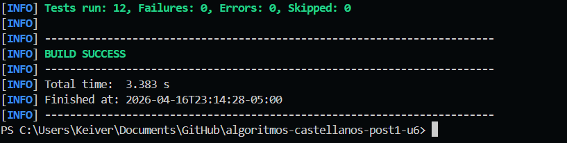
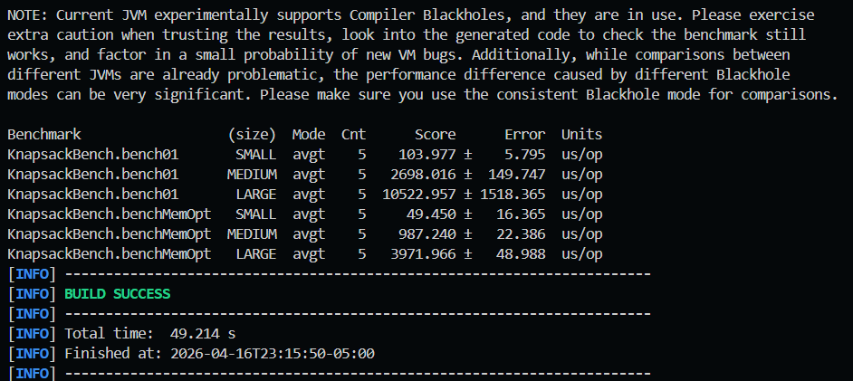

# algoritmos-castellanos-post1-u6

Laboratorio de Diseño de Algoritmos y Sistemas, Unidad 6.

Este proyecto implementa en Java 21 los algoritmos:

- Knapsack 0/1 con tabla completa DP y reconstrucción.
- Knapsack Unbounded con DP 1D.
- Knapsack 0/1 optimizado en memoria con DP 1D.
- Weighted Interval Scheduling con cálculo de p(j) por búsqueda binaria, DP y reconstrucción de trabajos.

## Estructura

```text
algoritmos-castellanos-post1-u6/
├── capturas/
│   └── .gitkeep
├── src/
│   ├── main/
│   │   └── java/
│   │       └── dp/
│   │           ├── Knapsack.java
│   │           ├── WeightedScheduling.java
│   │           └── bench/
│   │               └── KnapsackBench.java
│   └── test/
│       └── java/
│           └── dp/
│               ├── KnapsackTest.java
│               └── SchedulingTest.java
├── .gitignore
├── pom.xml
└── README.md
```

## Requisitos

- Java 17+ (probado con Java 21)
- Maven 3.9+

## Comandos de ejecución

Compilar y correr pruebas:

```powershell
mvn clean test
```

Ejecutar benchmarks JMH en PowerShell:

```powershell
mvn --% exec:java -Dexec.mainClass=org.openjdk.jmh.Main
```

Nota: en PowerShell se usa --% para que -Dexec.mainClass no sea reinterpretado por el shell.

## Resultados JMH

Unidad: microsegundos por operación (us/op), modo promedio.

| Metodo                    |                  Tamano | Score (us/op) | Error (99.9%) |
| ------------------------- | ----------------------: | ------------: | ------------: |
| solve01 (bench01)         |   SMALL (n=100, W=1000) |       103.977 |         5.795 |
| solve01 (bench01)         |  MEDIUM (n=500, W=5000) |      2698.016 |       149.747 |
| solve01 (bench01)         | LARGE (n=1000, W=10000) |     10522.957 |      1518.365 |
| solveMemOpt (benchMemOpt) |   SMALL (n=100, W=1000) |        49.450 |        16.365 |
| solveMemOpt (benchMemOpt) |  MEDIUM (n=500, W=5000) |       987.240 |        22.386 |
| solveMemOpt (benchMemOpt) | LARGE (n=1000, W=10000) |      3971.966 |        48.988 |

## Analisis de trade-off espacio/tiempo

Los resultados muestran una mejora consistente de tiempo en la version optimizada en memoria frente a la version con matriz completa. En el tamano SMALL, solveMemOpt tarda 49.450 us/op contra 103.977 us/op de solve01, lo que representa alrededor de 2.10 veces menos tiempo. En MEDIUM, la relacion aumenta: 987.240 frente a 2698.016 us/op, cerca de 2.73 veces mas rapido. En LARGE, solveMemOpt mantiene una ventaja clara (3971.966 vs 10522.957 us/op), aproximadamente 2.65 veces mejor. Esta diferencia es coherente con el comportamiento de cache: la variante O(W) recorre menos memoria total y reduce la presion de lectura/escritura respecto a la tabla O(n\*W).

Sobre escalabilidad, ambas variantes crecen al aumentar n y W, como predice la complejidad O(n\*W). El salto de SMALL a MEDIUM y luego a LARGE incrementa el costo de forma marcada en ambos metodos, pero solveMemOpt escala con menor constante oculta. Esto no cambia el orden asintotico, pero si impacta el tiempo real observado en ejecucion.

La decision practica depende del objetivo: si solo se requiere el valor optimo, solveMemOpt es preferible por menor memoria y mejor tiempo. Si ademas se necesita reconstruir directamente desde una tabla completa sin estructuras extra, solve01 es mas directo, aunque mas costoso. En problemas grandes o entornos con memoria limitada, la opcion optimizada en espacio suele ser la mejor eleccion.

## Evidencias

Captura de pruebas (JUnit en verde):



Captura de benchmark JMH:


